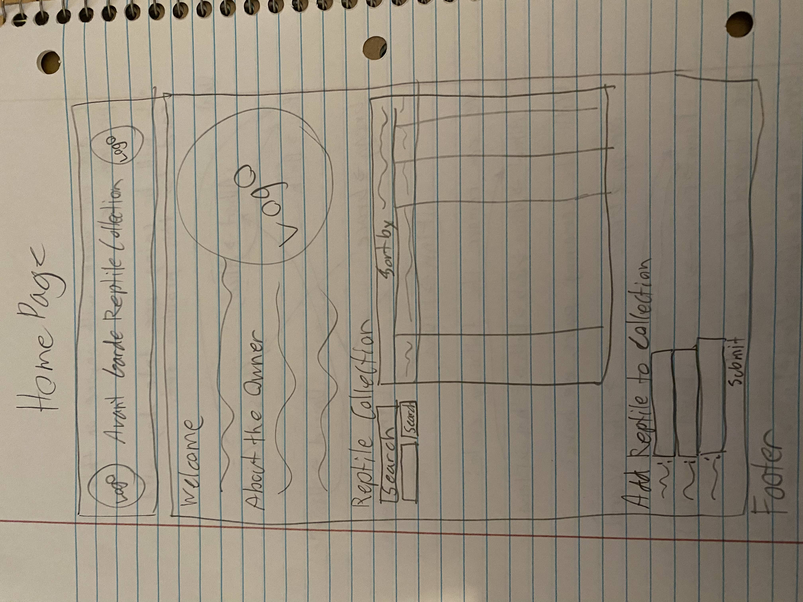
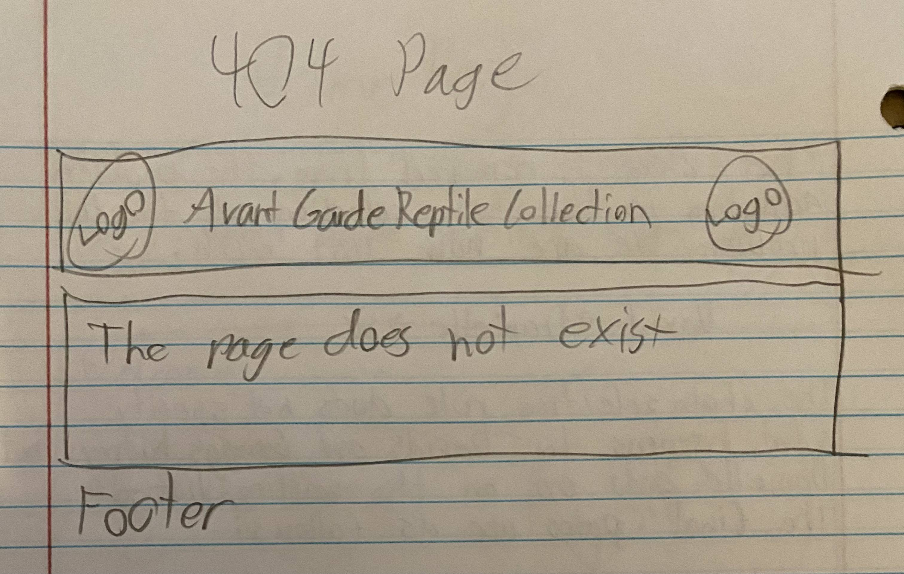
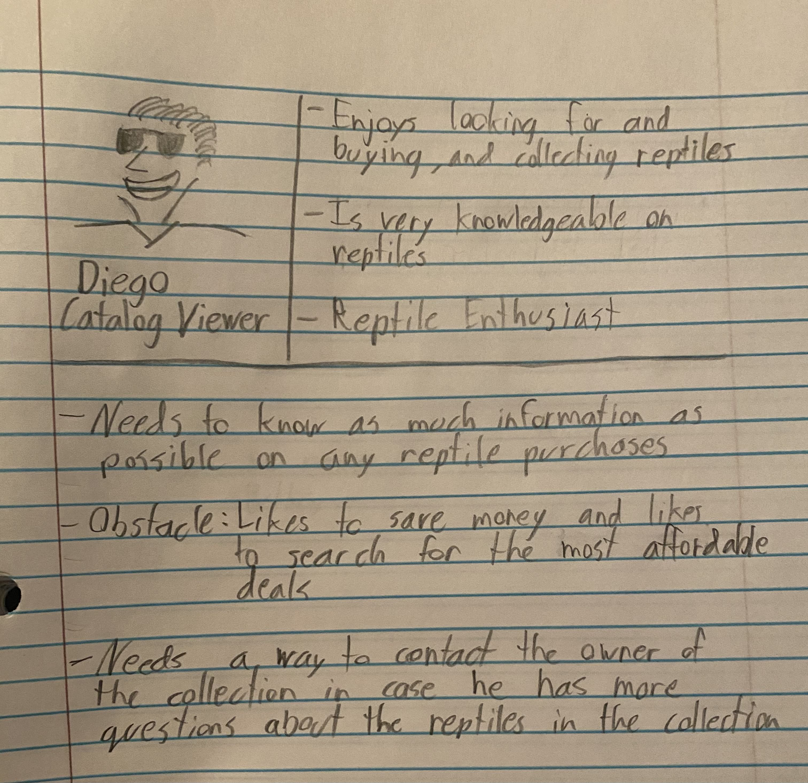
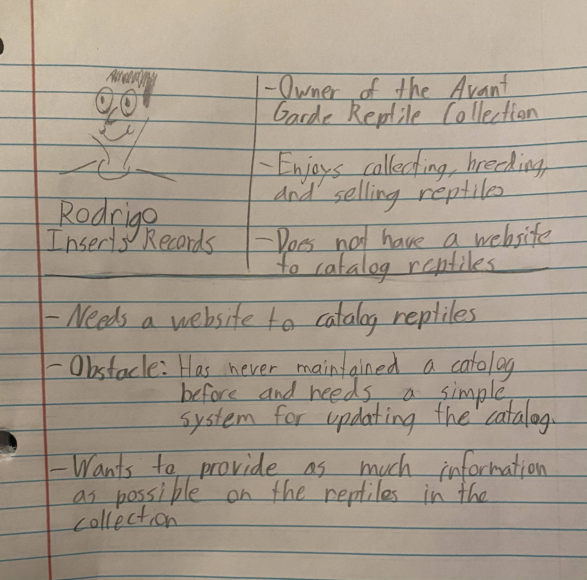
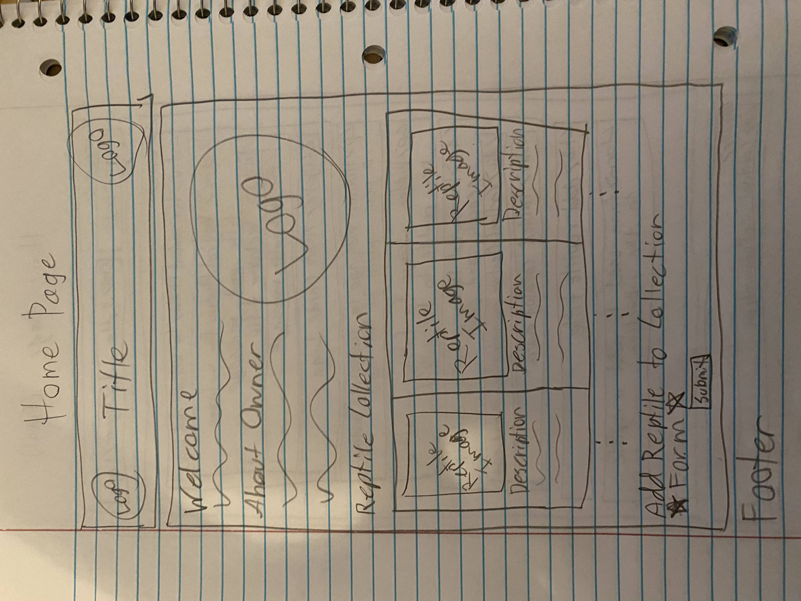

# Project 3: Design Journey

Be clear and concise in your writing. Bullets points are encouraged.

**Everything, including images, must be visible in Markdown Preview.** If it's not visible in Markdown Preview, then we won't grade it. We won't give you partial credit either. This is your warning.


## Design Plan

### Project 1 or 2
> Do you plan to reuse your Project 1 or 2 site?
> Which project?

I plan to reuse my Project 2 site.

> If yes, please include sketches of the site's current design (you may copy the "final" sections from those assignments.)




### Describe your Media Catalog (Milestone 1)
> What will your collection be about?
> What type of media will your site display? (images, videos, audio)

The collection will be about reptiles. My site will be displaying pictures of the reptiles in the Avant Garde Reptile Collection.


### Audiences (Milestone 1)
> Briefly explain your site's audiences. Be specific and justify why each audience is appropriate for your site.
> You are required to have **two** audiences: "information consumers" and "site administrators"

Information Consumer: The consumers of this website include individuals that are looking to buy reptiles and/or just want to browse reptiles. This audience is appropriate for the site because this site is intended to showcase reptiles that have been bred to create new snakes with different patterns that will be available for sale.

Site Administrator:  The audience that will be the site administrators include the owners of the Avant Garde Reptile Collection. This audience is appropriate for the site because as new reptiles are bred, the site's collection will expand and will need to be kept up to date.


### Personas (Milestone 1)
> Your personas must have a name and a "depiction". This can be a photo of a face or a drawing, etc.
> There is no required format for the persona.
> You may type out the persona below with bullet points or include an image of the persona. Just make sure it's easy to read the persona when previewing markdown.
> Your personas should focus on the goals, obstacles, and factors that influence behavior of each audience.

> Persona for your "consumer" audience:




> Persona for your "administrator" audience:




### Site Design (Milestone 1)
> Document your _entire_ design process. **We want to see iteration!**
> Show us the evolution of your design from your first idea (sketch) to the final design you plan to implement (sketch).
> Show us the process you used to organize content and plan the navigation, if applicable (card sorting).
> Plan your URLs for the site.
> Provide a brief explanation _underneath_ each design artifact. Explain what the artifact is, how it meets the goals of your personas (**refer to your personas by name**).
> Clearly label the final design.


- For this first design, I decided against using a navigation bar because there isn't enough content diversity to warrant a navigation bar. Creating a navigation bar would only take away from the site's simple design.
- The URL for this page is "/" or "/home".
- This page meets the needs of the needs of Rodrigo because it provides a simple design that he can quickly learn for updating the reptile collection.
- This page meets Diego's needs because it provides the images and all the information he would possibly need when deciding what reptiles he might be interested in purchasing.


### Design Patterns (Milestone 1)
> Write a one paragraph reflection explaining how you used the design patterns in your site's design.

For my site, I decided to go with a somewhat Instagram styled approach. I decided to go with a grid or tiled list of entries to display all of the reptiles. As Diego navigated the website and clicks on different reptiles or tags, the tiles will filter based on the reptile or tags he clicked on.


## Implementation Plan

### Requests (Milestone 1. Revise in Milestone 2)
> Identify and plan each request you will support in your design.
> List each request that you will need (e.g. view image details, view gallery, edit book, tag product, etc.)
> For each request, specify the request type (GET or POST), how you will initiate the request: (form or query string URL), and the HTTP parameters necessary for the request.

<!-- Example:
- Request: view movie details
  - Type: GET
  - URL: /movie/details?id=X
  - Params: id _or_ movie_id (movies.id in DB) -->

- Request: add reptile
  - Type: POST
  - URL: /home
  - Params: reptile_name, species, family, type, price

- Request: remove reptile
  - Type: POST
  - URL: /home
  - Params: reptile_name, species, family, type, price

- Request: create new tag
  - Type: POST
  - URL: /home
  - Params: tag_name

- Request: add tag to reptile
  - Type: POST
  - URL: /home
  - Params: reptile_id, tag_name

- Request: remove tag from reptile
  - Type: POST
  - URL: /home
  - Params: reptile_id, tag_name


### Database Schema (Milestone 1. Revise in Milestone 2)
> Describe the structure of your database. You may use words or a picture. A bulleted list is probably the simplest way to do this. Make sure you include constraints for each field.

> Hint: You probably need a table for "entries", `tags`, `"entry"_tags` (stores relationship between entries and tags), and a `users` tables.

> Hint: For foreign keys, use the singular name of the table + _id. For example: `image_id` and `tag_id` for the `image_tags` (tags for each image) table.

Table: reptiles
- id: INTEGER {PK, U, NN, AI},
- reptile_name: TEXT {}
- species: TEXT {NN}
- family: TEXT {NN}
- type: TEXT {NN}
- price: INTEGER {}

Table: tags
- id: INTEGER {PK, U, NN, AI},
- tag_name: TEXT {NN, U}

Table: reptile_tags
- id: INTEGER {PK, U, NN, AI},
- reptile_id: INTEGER {NN}
- tag_id: INTEGER {NN}
- FOREIGN KEY (reptile_id) REFERENCES reptiles(id)
- FOREIGN KEY (tag_id) REFERENCES tags(id)

Table: users
- id: INTEGER {PK, U, NN, AI},
- name: TEXT {NN}
- username: TEXT {NN, U}
- password: TEXT {NN}

Table: sessions
- id: INTEGER {PK, U, NN, AI},
- user_id: INTEGER {NN}
- session: TEXT {NN, U}
- last_login: TEXT {NN}
FOREIGN KEY (user_id) REFERENCES users(id)

Table: groups
- id: INTEGER {PK, U, NN, AI},
- name: TEXT {NN}

Table: memberships
- id: INTEGER {PK, U, NN, AI},
- group_id: INTEGER {NN}
- user_id: INTEGER {NN}
- FOREIGN KEY (group_id) REFERENCES groups(id)
- FOREIGN KEY (user_id) REFERENCES users(id)


### Database Query Plan (Milestone 1. Revise in Milestone 2)
> Plan your database queries. You may use natural language, pseudocode, or SQL.

1. All records

  ```
  SELECT * FROM reptiles;
  SELECT * FROM tags;
  SELECT * FROM reptile_tags;
  SELECT * FROM users;
  ```

2. Insert Records

  ```
  INSERT INTO reptiles (reptile_name, species, family, type, price) VALUES ('Betkey', '66% Lavender Hognose Snake', 'Hognose', 'Snake', 100);
  INSERT INTO tags (id, tag_name) VALUES (1, 'snake');
  INSERT INTO reptile_tags (reptile_id, tag_id) VALUES (1, 1);
  INSERT INTO users (name, username, password) VALUES ('Rodrigo Cervantes', 'rodi', '$2y$10$QtCybkpkzh7x5VN11APHned4J8fu78.eFXlyAMmahuAaNcbwZ7FH.');
  ```

3. Remove Reptile

  ```
  DELETE FROM reptiles WHERE (id=X);
  ```

4. Create New Tag

  ```
  INSERT INTO tags (id, tag_name) VALUES (1, 'snake');

  ```

5. Add tag to Reptile

  ```
  INSERT INTO reptile_tags (reptile_id, tag_id) VALUES (1, 1);
  ```

6. Remove Tag from Reptile

  ```
  DELETE FROM reptile_tags WHERE (id=X);
  ```

7. Search by Reptile

  ```
  SELECT * FROM reptile_tags WHERE (reptile_id=x);
  ```

8. Search by Tag

  ```
  SELECT * FROM reptile_tags WHERE (tag_id=x);
  ```

9. Join for Tags

  ```
  SELECT reptile_tags.reptile_id, reptile_tags.tag_id, tags.tag_name FROM reptile_tags INNER JOIN tags ON reptile_tags.tag_id = tags.id;
  ```


### Code Planning (Milestone 1. Revise in Milestone 2)
> Plan any PHP code you'll need here using pseudocode.
> Use this space to plan out your form validation and assembling the SQL queries, etc.
> Tip: Break this up by pages. It makes it easier to plan.

```
// Open connection to database

// Tagging
get tag values using GET
concatenate current query with tagged query
concatenate current url with tagged URL

// Add Reptile Form
initialize feedback message CSS classes
initialize additional validation constraints
initialize insert reptile values
set sticky values for the form
if the form is submitted {
    trim and save values
    set form valid to true
    if one of the inputs is empty {
        set form valid to false
        show the feedback message
    }
    if form is still valid {
        insert the new record into the database
    }
    if the record is inserted correctly {
        show message
    } else {
        show other message
    }
} else {
    set sticky values
}

// Remove Reptile Form
initialize feedback message CSS classes
initialize additional validation constraints
initialize remove reptile values
set sticky values for the form
if the form is submitted {
    trim and save values
    set form valid to true
    if one of the inputs is empty {
        set form valid to false
        show the feedback message
    }
    if form is still valid {
        remove record from the database
    }
    if the record is inserted correctly {
        show message
    } else {
        show other message
    }
} else {
    set sticky values
}

// Create Tag Form
initialize feedback message CSS classes
initialize additional validation constraints
initialize insert tag values
set sticky values for the form
if the form is submitted {
    trim and save values
    set form valid to true
    if one of the inputs is empty {
        set form valid to false
        show the feedback message
    }
    if form is still valid {
        insert the new tag into the database
    }
    if the record is inserted correctly {
        show message
    } else {
        show other message
    }
} else {
    set sticky values
}

// Add Tag to Reptile Form
initialize feedback message CSS classes
initialize additional validation constraints
initialize tag and reptile values
set sticky values for the form
if the form is submitted {
    trim and save values
    set form valid to true
    if one of the inputs is empty {
        set form valid to false
        show the feedback message
    }
    if form is still valid {
        insert the new tag for the reptile into the database
    }
    if the record is inserted correctly {
        show message
    } else {
        show other message
    }
} else {
    set sticky values
}

// Remove Tag from Reptile Form
initialize feedback message CSS classes
initialize additional validation constraints
initialize tag and reptile values
set sticky values for the form
if the form is submitted {
    trim and save values
    set form valid to true
    if one of the inputs is empty {
        set form valid to false
        show the feedback message
    }
    if form is still valid {
        remove the tag for the reptile from the database
    }
    if the record is inserted correctly {
        show message
    } else {
        show other message
    }
} else {
    set sticky values
}

// Inside the HTML
add conditions for feedback messages
adjust urls
fetch db data and populate the grid
create forms with validation
```

## Submission

### Audience (Final Submission)
> Tell us how your final site meets the needs of the audiences. Be specific here. Tell us how you tailored your design, content, etc. to make your website usable for your personas. Refer to the personas by name.

The final site meets Rodrigo's needs because he is able to edit his collection with ease and wile keeping the editing of the collection secure so he is the only ne that can edit the collection. The forms for editing the collection are easy to follow so there will be no confusion for him.

The final site meets the needs of diego because he is able to find the information that he needs about the reptiles on the page with ease and he can follow different tags by simply clicking on them.

The final design of the site if simple, polished, easy to follow, and appealing to the eye. 

### Additional Design Justifications (Final Submission)
> If you feel like you haven’t fully explained your design choices in the final submission, or you want to explain some functions in your site (e.g., if you feel like you make a special design choice which might not meet the final requirement), you can use the additional design justifications to justify your design choices. Remember, this is place for you to justify your design choices which you haven’t covered in the design journey. You don’t need to fill out this section if you think all design choices have been well explained in the design journey.

With regards to my database, I thought about the duplicate data oin my reptiles table and thought that maybe it would be best to make anther table to avoid the duplicate information on snakes, but then I realized that my reptiles table is only about one thing: reptiles. I decided to keep the table as it is because making another table would help if I had to one day make a change to the table, but the species, families and types of the reptiles are not going to change. I decided to stick with the table.

At one point I thought it might be best to have the adding and removing tags functionality within each entry on the grid, btu I started to get a lot of HTML validation errors because I had the same label for multiple inputs since in that implementation I created the form in a foreach-loop. The implementation I created was best for Rodrigo.

I was unable to make the 'select' elements on my forms sticky but those forms are very small and although it does hurt the user experience, I hope it doesn't hurt it too much.


### Self-Reflection (Final Submission)
> Reflect on what you learned during this assignment. How have you improved from Project 1? What things did you have trouble with?

This project was much more difficult than the first two. I spent a lot of time trying to figure out the best implementation since the writeup was rather open-ended when it came to tags. I learned a lot about SQL and creating a functional website that meets the needs of my audience.


### Grading: Mobile or Desktop (Final Submission)
> When we grade your final site, should we grade this with a mobile screen size or a desktop screen size?

Desktop please.


### Grading: Step-by-Step Instructions (Final Submission)
> Write step-by-step instructions for the graders.
> The project if very hard to grade if we don't understand how your site works.
> For example, you must login before you can delete.
> For each set of instructions, assume the grader is starting from /

Viewing all entries:
1. Login with either admin or non-admin account.
2. All entries will be displayed.
3. If you click on a tag or a reptile the entries will only show the entries with that tag or that specific reptile. Click the "Show Entire Collection" button to show all the entries again.

View all entries for a tag:
1. Click on a tag.
2. If you click on a tag the entries will only show the entries with that tag. Click the "Show Entire Collection" button to show all the entries again.

View a single entry and all the tags for that entry:
1. Click on the image of a reptile.
2. If you click on a reptile the entries will only show that specific reptile. Click the "Show Entire Collection" button to show all the entries again.

How to insert and upload a new entry:
1. File for upload must be in the public/uploads/documents directory and must be named after the next id for the reptiles table.
2. Try using '15.jpg' when adding a file. You can use 'https://www.instagram.com/agreptilecollection/' as the source.

How to delete an entry:
1. Select a Reptile from the dropdown menu under 'Remove Reptile from Collection'.
2. Click Submit

How to view all tags at once:
1. Login with either admin or non-admin account.
2. All tags will be displayed.
3. If you click on a tag or a reptile the entries will only show the entries with that tag or that specific reptile. Click the "Show Entire Collection" button to show all the entries again.

How to add a tag to an existing entry:
1. Select a Reptile from the dropdown menu under 'Add Tag to Reptile'.
2. Select the tag you want to add from the dropdown menu.
3. Click Submit.

How to remove a tag from an existing entry:
1. Select a Reptile from the dropdown menu under 'Remove Tag from Reptile'.
2. Select the tag you want to remove from the dropdown menu.
3. Click Submit.
